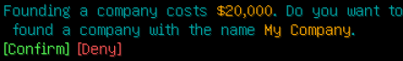

# Founding a company

You can found a company with the `/company create <name>` command. After this you will have to pay a fee, which you need to confirm.

Congratulation your company is founded!

# Inviting user

To invite a user, use the `/company invite <player>` command.

Once a player has been invited, the invitation needs to be confirmed within 1 minute by the invited player.

# Managing your company
You can manage your company with the `/company` command. Everything you need is located there.

## Managing members
Click on the `[List]` button at members.

This will give you a list of all members of your company

If you hover over the member, you will see their current online status and their permissions if they have some

## Giving permissions
Click on the `[Permission]` button in your member list.

Clicking on a permission will disable or enable it.

### Managing Company Orders
Click on the `[List]` button next to orders.

This will show you a list of the currently active orders of your company.

### Claiming a order
Once you claimed a order, only your company can deliver the goods for it.

To claim a order you need to find it. Open the order search by pressing on the `[Search]` button in your order list.

You can change the values by clicking on the buttons. You can also change the ordering and sorting type of the results. Once you are done with configuring your search you can press on `[Search]` to see your results.

In our case we found one result for our search an a order of someone. You can hover over the order names to get some additional information. to claim it you need to click in the `[Info]` button.

To claim it all you need is press on the `[Accept]` button. Once you pressed the button you have a configurable amount of time to deliver the goods. If you fail to deliver it the order will become unclaimed again and all already delivered items will be lost.

### Deliver Goods for a order
Click on the `[Info]` button in your order list.

This will bring up a menu which allows you to deliver good by pressing on buttons with the amount you want to turn in. You can also see the remaining time here to deliver the goods.

Once all goods are delivered the order will be automatically complete and the goods will be delivered to the player which ordered the goods. All players which submitted goods will be payed equal to their contribution.

